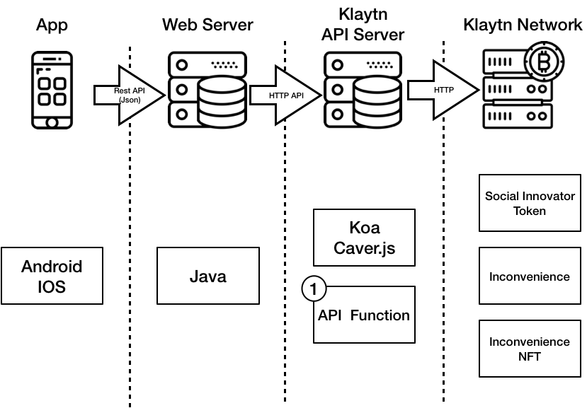

# 1. Introduction

> 프로젝트에 대한 소개

> 대표 features
> 1-1. [Contract] 글 등록
> 1-2. [Contract] 유저 보상
> 1-3. [Contract] NFT
   
   
# 2. Systems Architecture



## API Function List

* 사용자 등록  
* 사용자 전체 조회  
* 코인 요청  
* 코인 송금  
* 잔액 조회  
* 불편함 글 등록  
* 불편함 글 조회  
* 불편함 글 전체 조회  
* 사용자 레벨 업  
* 사용자 레벨 확인 
* 이름 변경권 구매  
* 사용자 이름 변경  
* 사용자 상태 확인  


# 3. SmartContract Code OverView

 해당 파일럿 프로젝트는 총 3가지의 SmartContract를 가지고 있다.  
   

   
* 글을 작성하고, 기록하는 `Inconvenience` Contract
* 유저의 보상이 되고, 유저의 지불 수단이 되는 `Social Innovator Token` Contract
    - 우리는 지불 수단의 역할을 수행하는 토큰을 만들기 위하여 ERC20 을 사용했다.
    - Check out detailed information about ERC20 at [eips.ethereum.org](https://eips.ethereum.org/EIPS/eip-20)
* User의 닉네임과 Level 정보를 담고 있는 대체 불가능한 토큰 `InconvenienceNFT` Contract
   - 우리는 대체 불가능한 토큰을 만들기 위해 ERC721 표준을 사용했다.
   - Check out detailed information about ERC721 at [erc721.org](erc721.org)
   
## 3-1. SIToken (Social Innovator Token)
> Name : Social Innovator Token  
Symbol : SIT  
Decimals : 18  

   
ERC20 표준을 사용했고 특별한 상황에 대비하기 위한 `Pausable`, 부정사용자를 막기 위한 `BlackList`, 관리자용 다중 송금 `MultiTransferToken`를 추가하였다. 


## 3-2. Inconvenience
   
Inconvenience Contract는 유저의 글을 등록하고 유저에게 보상을 제공한다.   
글을 등록하는 것은 단순히 제목과 내용을 기록하면 되지만 특정 조건에 따라 글을 조회하고, 특정 조건에 따라 보상을 하기 위해서는 여러가지 추가적인 데이터가 필요하다.   
   
그래서 우리는 위와 같은 기능들을 RewardPool, UserStore, InconvenienceStore 세 가지의 Contract로 분리하였다.   
각 Contract는 서로를 호출하지 않으며, 각자 Reward, UserData, InconvenienceData를 관리한다.   
   

### 3-2-1. 'InconvenienceStore' Data Structure
   
InconvenienceStore Contract는 `불편함` 글을 구조체로 저장하는 Contract이다.   
각 글들은 배열의 n번째에 기록되고, 글을 작성한 owner에게 n번째에 글이 등록 된 사실을 알린다.   
   
`Inconvenience` 구조체안에는 글의 주인을 나타내는 `owner`, Web Server에 기록되어있는 글의 고유한 번호 `id`, 글의 제목 `tag`, 글의 내용 `contents`, 글이 블록체인에 기록 된 시간을 나타내는 `timestamp`가 존재 한다.
   
작성된 글들은 구조체 배열에 저장된다.  
   
   
```
event insertInconvenienceEvent (uint256 _idx, address _address, string _id, string _tag, uint256 _timestamp);
    
struct Inconvenience {
    address owner;
    string id;
    string tag;
    string contents;
    uint256 timeStamp;
}

Inconvenience[] private inconveniences;
```
   
   
### 3-2-2. 'UserStore' Data Structure
   
UserStore Contract는 User Data를 User의 Public Address에 맵핑 하여 저장 한다.   
유저는 맵핑하여 저장하고, 작성된 글은 배열로 저장하는 이유는 유저를 배열로 저장한다면 중복된 유저를 검사하는 것에 GAS를 지불 해야할 것이다. 그렇기 때문에 유저는 배열보다 맵핑으로 저장되는 것이 더 효율적이다.   
작성된 글의 경우 유저가 자신이 작성한 글에 대한 Index를 배열로 저장하고 있기 때문에 맵의 형식 보다 배열의 형식이 GAS를 절감할 수 있기 때문이다.   
`UserData`안에는 BlockChain 상의 가입 번호를 나타내는 `userCount`, 일일 보상량을 확인할 수 있는 `rewardCount`, 일일 보상량 초기화를 위해 기록하는 `lastTimeStamp`, 유저의 글을 번호로 저장하여 유저가 소유한 글을 조회할 수 있는 `userInconv`가 있다.
   
   
```
event NewMemberEvent(address _user, uint256 _userCount, uint256 _timestamp);

struct UserData {
    uint64 userCount;
    uint8 rewardCount;
    uint256 lastTimeStamp;
    uint256[] userInconv;
}
    
mapping(address => UserData) private userStore;
```
   
   
### 3-2-3. SignUp function
   
```
function signUp() external canSignUp
```
   
Inconvenience Contract에서는 글을 등록하기 전 Sign Up 과정을 거쳐야한다.   
UserData안에 n번째 유저를 뜻하는 `userCount`는 글을 작성하는 시점이 아닌, 서비스에서 회원가입을 완료한 시점에 증가해야하기 때문이다.   
   
   
### 3-2-4. Post Inconvenience function
   
```
function postInconvenience(string _id, string _contents, string  _tag) external onlyMember {
    insertUserInconv(inconvCount);        
    insertInconvenience(_id, _contents, _tag);
    checkUserRewardCount();
}
```
   
글을 등록 하는 것은 가입된 유저만 가능하다. 이는 서비스를 통하여 접근하지 않고, 다른 방식으로 Contract에 접근하는 유저들을 막기 위함은 아니다. 회원가입 function은 일반 유저가 서비스를 통해 접근하지 않아도 호출이 가능하기 때문이다. 그럼에도 가입된 유저임을 체크하는 이유는 정상적인 회원가입 절차를 통하여 `totalUserCount`를 증가시켰는지를 검사하기 위함이다.   
   
`insertUserInconv(inconvCount);`는 새로 생성된 글의 index를 해당 User의 UserData에 기록해준다. 이를 통하여 유저는 자신의 글의 index들을 배열로 가지고 있을 수 있다.   
   
`insertInconvenience(_id, _contents, _tag);`는 Klaytn API로 부터 전달 받은 글의 정보를 배열에 기록한다.   
   
```
function insertInconvenience(string _id, string _contents, string  _tag) internal {
    Inconvenience memory _inconvenience = Inconvenience({
        owner: msg.sender, 
        id: _id,
        contents: _contents,
        tag: _tag,
        timeStamp: now
    });

    inconveniences.push(_inconvenience);        
    inconvCount = inconvCount.add(1);

    emit insertInconvenienceEvent(inconvCount, msg.sender, _id, _tag, now);
}
```
   
   
위와 같이 새로 생성된 글은 `inconveniences` 배열에 push 된다. `A User가 작성한 글`을 조회 한다고 가정할 때, inconveniences.length 만큼 반복문을 돌며 글의 owner가 A인지 확인할 수도 있다.(Klaytn Network 데이터 조회는 Gas가 소모되지 않기 때문이다.) 하지만 이는 글이 증가 될 때마다 검색비용이 증가 될 것이다. 이것이 UserData안에 User가 작성한 글의 Index를 저장하는 이유이다.   
   
   
`checkUserRewardCount();`는 `일일 보상 횟수 검사`, `보상`의 기능을 수행한다.   
   
```
function checkUserRewardCount() internal {
    checkResetRewardCount();
    
    if(userStore[msg.sender].rewardCount < dailyRewardCount) {
        tokenTransfer();
        IncreaseRewardCount();
    }
    
    changeLastTimeStamp();
}
```
   
첫 번째로 `checkResetRewardCount();`는 User가 받은 보상 횟수의 초기화를 검토한다. UTC+09 기준으로 00시 마다 보상 횟수를 초기화시켜야 했기 때문에 timestamp를 날짜로 변환시켜야 했다. 이를 위해 우리는 DateTime Contract를 사용하였다.    
- Check out detailed information about DateTime at [github](https://github.com/pipermerriam/ethereum-datetime)
   
또한, 효율적인 Gas사용을 위하여 User가 마지막으로 기록한 시간 `UserData.lastTimeStamp`를 Day를 변환하고, 현재 TimeStamp를 Day로 변환하여 비교하였다. Day 같다면 Month를 비교하였다. year의 경우 발생할 확률에 비하여 조건검사로 소모되는 Gas비용이 크다고 판단하여 비교하지 않았다.   
   
```
function checkResetRewardCount() private {
    // UTC+09:00
    uint8 lastDay = getDay(userStore[msg.sender].lastTimeStamp + 32400);
    uint8 curDay = getDay(now + 32400);
    
    if(lastDay != curDay) {
        userStore[msg.sender].rewardCount = 0;
    } else {
        uint8 lastMonth = getMonth(userStore[msg.sender].lastTimeStamp + 32400);
        uint8 curMonth = getMonth(now + 32400);
        
        if(lastMonth != curMonth) {
            userStore[msg.sender].rewardCount = 0;
        }
    }
}
```
   
두 번째로는 user의 보상 횟수를 검토하고, 보상을 받을 수 있다면 `tokenTransfer();`로 보상을 지급하고, `IncreaseRewardCount();`로 보상 횟수를 증가시킨다.   
   
마지막으로는 `changeLastTimeStamp();`로 `UserData.lastTimeStamp`를 갱신하여 유저의 마지막 보상시간을 기록한다. 첫 번째 Step이였던 보상 횟수 초기화를 위함이다.   
   
   
## 3-3. InconvenienceNFT
> Name : Inconvenience Rank  
Symbol : IR
   
ERC721 표준을 지켰고, 유저의 NFT에는 유저의 닉네임과 Level이 담겨있으며 유저가 일정 SIT을 지불하면 Level Up과 닉네임 변경을 할 수 있다.   
   
   
### 3-3-1. 'InconvenienceNFT' Data Structure
   
TokenData에는 User의 Level과 NickName 그리고, NickName 변경권 구매 여부가 담겨있다.   
TokenData는 token의 index번호에 mapping 되어 있고, 각 Level 마다 지불해야할 Cost는 추후 업데이트를 위하여 가변 배열로 저장한다.
   
   
```
struct TokenData {
    uint256 level;
    string nickName;
    bool nickNameTicket;
}
mapping (uint256 => TokenData) private tokenDataList;
uint256[] private LvUpCost;
uint256 private nickNameCost;
```
   
   
### 3-3-2. Mint Unique Token Function
   
```
modifier canMint() { require(balanceOf(msg.sender) == 0); _; }

function mintUniqueToken(string nickName) external canMint {
    uint256 tokenId = totalSupply();
    _mint(msg.sender, tokenId);
    TokenData memory newTokenData = TokenData({
        level : 0,
        nickName : nickName,
        nickNameTicket : false
    });
    tokenDataList[tokenId] = newTokenData;
    emit TokenMint(msg.sender, tokenDataList[tokenId].level, tokenDataList[tokenId].nickName);
}
```
   
우리가 사용하는 NFT는 유저의 활동 내용들이 토큰화 된 것이기 때문에 한 명의 User가 여러개의 토큰을 소유할 필요도 없고, 토큰이 누군가에게 전송될 필요도 없다. `canMint()`를 통하여 User가 한 개의 토큰만 생성할 수 있도록 제한 했다.   
   
   
### 3-3-3. Level Up & Change NickName
   
Level Up function과 NickName 변환 권한을 구매하는 function은 같은 플로우로 동작한다.   
   
(1) 유저가 구매를 할 수 있는 조건인지   
(2) 유저가 구매할 항목의 cost 만큼 Social Innovator Token을 allowed 하였는지    
(3) 유저의 SIT을 관리자 계정으로 TransferFrom   
(4) 구매 항목 반영   
   
   
# 4. Improvements
   
   
### 4-1. Gas비용
   
`3-2-3` Sign Up 처럼 Smart Contract에서는 특정 데이터로 인하여 조건문이 추가 되거나, 함수가 분리 되는 문제가 쉽게 발생한다. 해당 상황에서도 UserData안에 userCount가 존재하지 않았다면 함수의 갯수가 줄어들고, 유저가 글을 등록할 때마다 호출 하는 함수안에서 검사 되는 조건도 줄어들어 Gas Used by Transaction이 줄었을 것이다. `userCount` 변수로 인하여 줄어들 수 있는 Gas와 `userCount`의 필요성을 계산해볼 필요가 있었다.
   
   
### 4-2. 어뷰징 방지
   
회원 가입, 글 등록등 모든 Transaction은 User의 Private Key로 서명 한다. 즉, 누구나 Contract에 접근하여 회원 가입을 진행 하고, 글을 작성하여 일일 보상을 가지고 갈 수 있음을 의미한다. 글을 등록할 때 들어가는 Transaction Fee 보다 작성으로 얻을 수 있는 토큰의 가치가 크다면 User들은 어뷰징을 할 것이다. 이를 해결하기 위해서 가장 쉬운 방법은 User가 서명하여 수수료를 대신 납부하는 것이 아닌, 관리자가 직접 Transaction을 발생시키는 것이다. 하지만, 이것은 어뷰징을 방지하는 대신 `탈중앙화`를 잃는 것을 뜻할 수도 있다. 서비스에서 이 문제를 해결하기 보다는, Contract 내에서 이런 어뷰징을 방지할 수 있는 방법을 찾아보는 것이 더 효율적일 수 있다.
   
   
### 4-3. 글 등록 방식 개선
   
처음 우리는 글을 등록 할 때, 별다른 암호화 없이 String 형식의 기록을 진행 했다. 하지만, User에 Gas 비용을 예측하기 힘들었고 특정 인원만 조회가능한 `비밀함`과 같은 시스템에서는 암호화가 필요했다. 생각이 된 암호화 방식은 AES(Advanced Encryption Standard)와 SHA-256(Secure Hash Algorithms)이 있었다.  
   
AES는 원본 데이터보다 암호화 된 데이터의 길이가 증가하지만 복호화가 가능하다는 장점이 있고,   
SHA-256은 복호화가 불가능하여 블록체인에 기록된 데이터를 `검증용`으로만 사용해야하지만, GAS비가 비교도 되지 않을 만큼 감소하고 User들의 Gas 비용을 예측하는 것이 가능해진다는 장점이 있었다.
   
Klaytn Network가 Ethereum과 같은 Public Blockchain 보다 Gas 비용이 저렴하다고는 하지만, 원본 데이터 자체를 블록체인에 기록하는 것은 Gas 비용 면에서도 또, Klaytn Network에게도 좋은 방법은 아니라고 생각하였다. 그렇기 때문에 현재 우리는 SHA-256 암호화를 선택했다. 하지만 복호화 가능한 데이터를 올린다면 '불편함 데이터'의 2차 판매, 3차 판매가 P2P로 이루어질 수 있을 것이다.
   
   
### 4-4. '좋아요' 기능
   
현재 글을 작성하면 조건 없이 유저에게 하루 n회 보상을 해주고 있다. 하지만 글 작성 이외 '좋아요'에 대한 보상은 기존 Web Server에서 처리를 해주고 있다. 파일럿 프로젝트이기 때문에 기한이 유한하여 포기한 기능중 하나인데. '좋아요'에 대한 Data를 UserData 그리고, Inconvenience Data에 추가 한다면 쉽게 추가 가능하다. 단, 글 보상 보다 까다로운 조건 검사가 필요하기 때문에 Gas에 대하여 많은 생각이 필요할 것 같다.
   
   
### 4-5. Business Logic과 Storage의 분리
   
이번 프로젝트에서 가장 아쉬움이 남는 부분은 Contract에서 Storage를 분리해내지 못한 점이다. 해당 프로젝트를 업데이트 하거나 방식을 조금 변경하게 된다면 파일럿 프로젝트를 서비스하는 기간에 기록 된 User Data, Inconvenience Data를 사용하지 못하게 될 것이다. 이것은 SmartContract의 단점이고, 분리된다고 해도 Data가 추가 되는 것은 불가능 할 수 있지만 Storage와 Logic을 분리한다면 어느 정도의 변경에는 대비할 수 있었을 것이다.
   
   